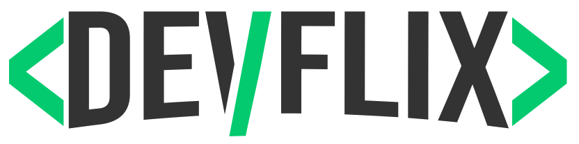
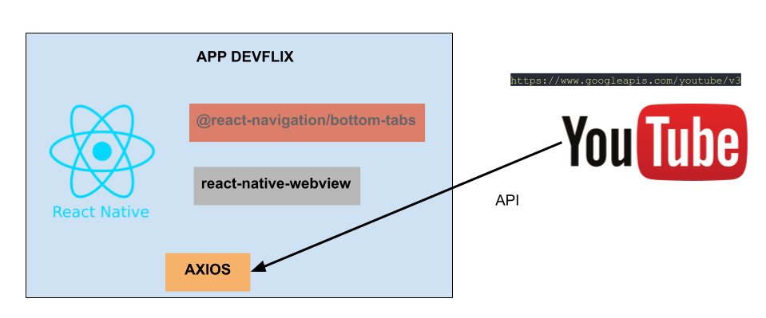

   

# :movie_camera: DevFlix

> Aplicação para você dev, poder assistir vídeos sobre programação.

[![NPM Version][npm-version]][npm-version]
[![NPM License][npm-license]][npm-license]
[![Code Size][code-size]][code-size]

Aplicativo mobile que consome a Api do Youtube e lista conteúdos para desenvolvedores de software e apaixonados por programação.

## :nazar_amulet: Objetivo

| Dar acesso ao conteúdo das disciplinas do curso de Desenvolvimento de Sistemas do Senai. O contéudo está em formato de vídeo.

## :black_nib: Justificativa

| Este projeto faz parte das atividades avaliativas do curso de desenvolvimento de sistemas para dispositivos móveis do curso de DS do SENAI.

## :man_technologist: Autor

Foto | Nome | GitHub | E-mail
---- | ---- | ------ | -------
  | Victor Damasceno Martins | [Victor Damasceno](https://github.com/xZeroW) | vic.marts@gmail.com

## :computer: Tecnologias

- [JavaScript](https://www.javascript.com/)
- [React Native](https://facebook.github.io/react-native/)
- [Expo](https://docs.expo.io)
- [Axios](https://github.com/axios/axios)

## :construction_worker: Instalação

Você precisa instalar o [Node.js](https://nodejs.org/en/download/) e o [Expo](https://docs.expo.io) primeiro e, em seguida clone o repositório.

## :wrench: Instalar dependências

1. Execute "npm/yarn install" para instalar as dependências;
2. Execute "npm/yarn start" para iniciar o aplicativo;

## :gear: Arquitetura do App

Uma amostra de como as tecnologias estão se relacionando no DevFlix.

Foi utilizado o React Native para desenvolver a estrutura do app, e através da biblioteca axios consumimos a api do Youtube que nos retorna os vídeos desejados.

## :handshake: Contribuindo

Confira a página [CONTRIBUTING](https://github.com/rafaellevissa/appDevFlix/blob/master/CONTRIBUTING.md) página para ver os melhores locais para arquivar problemas, iniciar discussões e começar a contribuir.

## :open_book: License

Lançado em 2020.
Este projeto está sob a [MIT license](https://github.com/rafaellevissa/appDevFlix/blob/master/LICENSE).

    Feito com :heart: por <a href="https://github.com/xZeroW">Victor Damasceno</a>

<!-- Markdown link & img dfn's -->

[npm-license]: https://img.shields.io/npm/l/express?color=03ca6f&style=plastic
[npm-version]: https://img.shields.io/npm/v/npm?color=333333&style=plastic
[code-size]: https://img.shields.io/github/languages/code-size/rafaellevissa/appDevFlix?color=03ca6f&style=plastic
